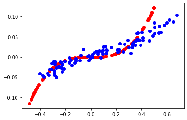
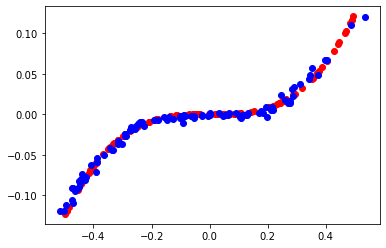
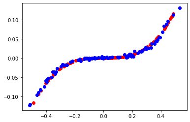
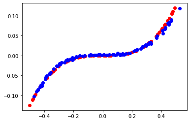
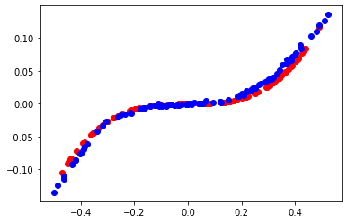

# 1D-GAN
Implementation of a one-dimensional Generative Adversarial Network that generates a cubic function using Keras.

## Results
After 2000 epochs
 
</img>
 
After 4000 epochs
 
</img>
 
After 6000 epochs
 
</img>
 
After 8000 epochs
 
</img>
 
After 10000 epochs
 
</img>

## Improvements:
1. More number of hidden layers
2. Different activation functions
